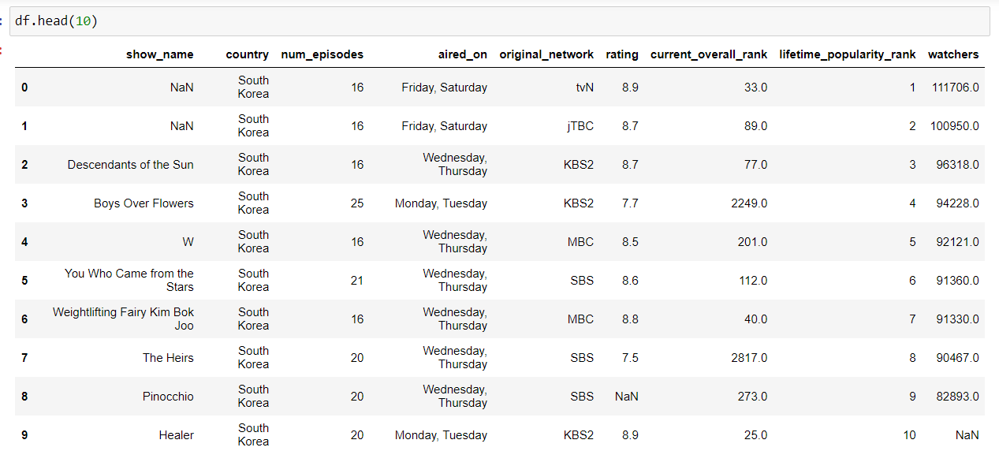
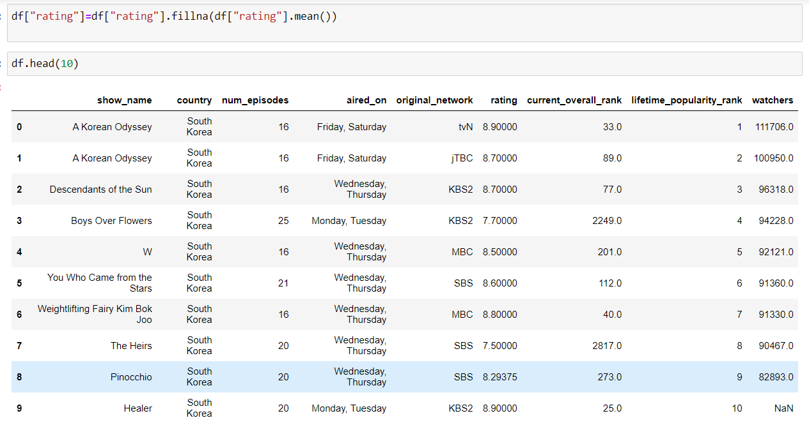
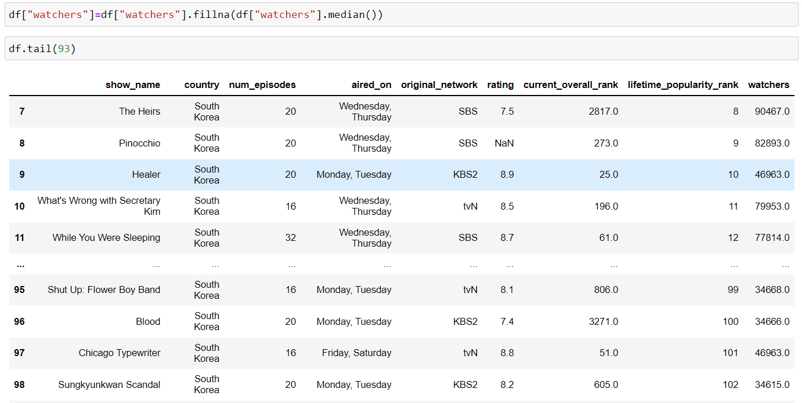

# Ex-01_DS_Data_Cleansing


## AIM
To read the given data and perform data cleaning and save the cleaned data to a file. 

# Explanation
Data cleaning is the process of preparing data for analysis by removing or modifying data that is incorrect ,incompleted , irrelevant , duplicated or improperly formatted. 
Data cleaning is not simply about erasing data ,but rather finding a way to maximize datasets accuracy without necessarily deleting the information. 

# ALGORITHM
### STEP 1
Read the given Data
### STEP 2
Get the information about the data
### STEP 3
Remove the null values from the data
### STEP 4
Save the Clean data to the file


# CODE
```
import pandas as pd
df = pd.read_csv("Data_set.csv")
df.head(10)
df.tail()
df.info()
df.isnull().sum()
df["show_name"]=df["show_name"].fillna(df["show_name"].mode()[0])
df.head(10)
df["rating"]=df["rating"].fillna(df["rating"].mean())
df.info()
df["aired_on"]=df["aired_on"].fillna(df["aired_on"].mode()[0])
df.info()
df["original_network"]=df["original_network"].fillna(df["original_network"].mode()[0])
df.info()
df["current_overall_rank"]=df["current_overall_rank"].fillna(df["current_overall_rank"].median())
df.info()
df["watchers"]=df["watchers"].fillna(df["watchers"].median())
df.info()
```
# OUPUT
### Data Frame:



### Columns with their corresponding Non-Null data count:


### Sum of Null data in corresponding Columns:


### Column- show_name:
#### Before handling Null data:

#### After handling Null data:


### Column- rating:
#### Before handling Null data:

#### After handling Null data:



### Column- aired_on:
#### Before handling Null data:

#### After handling Null data:


### Column- original_network:
#### Before handling Null data:

#### After handling Null data:


### Column- current_overall_rank:
#### Before handling Null data:

#### After handling Null data:


### Column- watches:
#### Before handling Null data:

#### After handling Null data:


### After Handling all Null data:

## Result:
Missing data Or Null data has been handled and regularly structured  data is produced. 